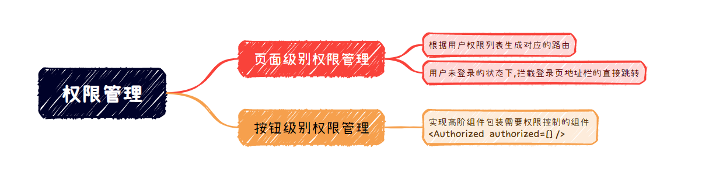
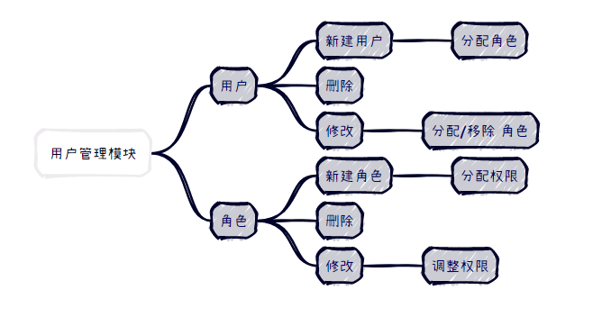
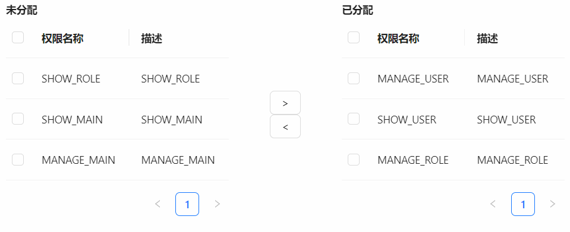

## 基于RBAC模型实现前端权限管理

> RBAC(Role-Based Access Control)基于角色的访问控制,通过角色将用户和权限联系起来,权限不直接分配给用户,而是分配给角色,每个角色便是一个权限集,一个用户可以拥有多个角色

接下来从前端的角度使用react基于最基础的RBAC0实现一下前端的权限控制:

## 权限分析

老规矩,在开始之前先分析一波从什么地方下手,首先项目中需要实现权限控制的地方大致有两种: 某个组件是否能查看和某些操作是否可执行即`访问权限和操作权限`,

从粒度上来讲对于粒度较大的页面级组件只需要控制其访问权限即可,对于粒度小的组件,比如按钮则可能需要同时控制其访问权限和操作权限,那么可以在不同粒度去考虑权限的控制方式:

- 页面级: 页面都是和路由想关联的,直接根据用户权限生成对应的路由,便可以实现其`访问权限的控制`
  - 另外的,项目中基本都会有一些公共路由,如登录,首页等等,那么需要限制用户在未登录的状态下在地址栏直接从登录路由对其他路由的访问,这里可以通过`导航守卫`或`从路由分离登录页`来实现,下文这两种方式都会尝试实现一下
- 组件级: 为了将权限控制逻辑不参杂在业务代码中,可以通过HOC包装需要鉴权的组件,赋予组件权限校验的功能



## 权限控制实现

> 这里就不重新起项目了,使用上篇博文中的[demo项目](https://juejin.cn/post/7322037150425464844)

权限分析是分析完了,但感觉还是很空洞,还是先把后端返回的权限数据简单模拟一下吧:

```js
const auths = ["SHOW_USER","MANAGE_USER","SHOW_ROLE","MANAGE_ROLE"];
看着可能比较low,能清晰表达意思就行: SHOW_USER表示具有访问user页面的权限,MANAGE_USER表示具有操作用户的权限,之后需要跟细致的权限再加吧
```

OK,看到数据之后心里踏实多了,权限控制归根结底就是`当用户触发某些行为的时候遍历这个列表来判断用户是否有权限`,顺着这个思路先来实现一下页面级的权限控制吧.

### 前置工作

#### 路由结构设计

还是先分析分析,react-router@6可以很方便的直接配置路由表了,可以将每个路由的所需的权限可以定义在路由表中一个自定义属性上,属性就叫`authority`吧,同时呢这种项目一般都有导航栏,并且导航栏的配置和路由的配置结构非常相似,那能不能将两者合并一下,减少一次配置呢?先来看看两个配置的必要结构吧:

```js
导航栏配置:
MenuItem {
  label: React.ReactNode,
  key: React.Key,
  icon?: React.ReactNode,
  children?: MenuItem[],
}

路由表配置:
RouteItem {
    path: string,
    element: JSX.Element,
    authority?: string[],
    children?: RouteItem[]
}
```

看起来可以直接糅杂在一起,使用的时候根据结构再将两种配置提取出来:

```js
MenuAndRouteItem {
    name?: string, // 菜单栏名称,
    icon?: JSX.Element, // 菜单图标
    path?: string,      // 对应路由路径
    element?: JSX.Element,// 路由对应组件
    children?:RouteItem[], // 子路由,不出现在导航菜单中
    authority?: string[],  // 访问路由所需权限 
    menuItems?: MenuAndRouteItem[] // 子级导航,具有该属性时,表示当前层级是一个父级导航,此时配置path和element无效
}
```

结构这块设计好了,接下来还要考虑一件事情: 有的路由是不需要出现在导航栏中的,因此,可以将路由分一下类: `需要出现在导航栏中`和`不需要出现在导航栏中`,第一类路由就定义在`routes/menuRoutes.tsx`中吧,第二类路由定义在`index.tsx`中,最终使用路由的时候再将`routes/menuRoutes.tsx`中的路由提取出来放在`routes/index.tsx`中,既然需要提取的话我需要一个提取路由的方法`getRoutes()`,OK,先把这些实现一下:

文件夹结构:

```js\
routes             
├─ index.tsx       
└─ menuRoutes.tsx  
```

```js
index.tsx: 编写不要出现在导航栏中的路由

import { Navigate } from 'react-router-dom';
import routes, { getRoutes } from './menuRoutes';
import LazyLoading from '@/components/lazyLoading';
import { lazy } from 'react';

const BaseLayout = LazyLoading(lazy(() => import('@/layouts/baseLayout')));
const LoginLayout = LazyLoading(lazy(() => import('@/layouts/loginLayout')));
const Login = LazyLoading(lazy(() => import('@/pages/login')));

const baseRoutes = [
  {
    path: '/',
    element: LoginLayout,
    children: [
      {
        path: '/login',
        element: Login
      }
    ]
  },
  {
    path: '/',
    element: BaseLayout,
    children: [
      ...getRoutes(routes),
      {
        path: '*',
        element: <Navigate to="/main" />
      }
    ]
  }
];
export default baseRoutes; //将完成的路由配置导出

```

```js
menuRoutes: 编写路由和导航栏结合的配置表和getRoutes方法:

import LazyLoading from '@/components/lazyLoading';
import { lazy } from 'react';
import { VideoCameraOutlined } from '@ant-design/icons';

const Main = LazyLoading(lazy(() => import('@/pages/main')));
const User = LazyLoading(lazy(() => import('@/pages/user')));
const Role = LazyLoading(lazy(() => import('@/pages/role')));

// 路由和侧边栏菜单由此生成
const routeMenuMap = [
  {
    name: 'Home',
    icon: <VideoCameraOutlined />,
    menuItems: [
      {
        name: '首页',
        icon: <VideoCameraOutlined />,
        path: '/main',
        element: Main
      }
    ]
  },
  {
    name: '权限管理',
    icon: <VideoCameraOutlined />,
    menuItems: [
      {
        name: '用户管理',
        icon: <VideoCameraOutlined />,
        path: '/user',
        element: User,
        authority: ['SHOW_USER', 'MANAGE_USER']
      },
      {
        name: '角色管理',
        icon: <VideoCameraOutlined />,
        path: '/role',
        element: Role,
        authority: ['SHOW_ROLE', 'MANAGE_ROLE']
      }
    ]
  }
];

export function getRoutes(routeMenuMap: any) {
  return routeMenuMap.reduce((acc: any, curr: any) => {
    if (curr.menuItems) {
      // 表示这一级是菜单,将其routes加入路由表中
      acc.push(...getRoutes(curr.menuItems));
    } else {
      // 表示这一级是路由,提取路由信息放入路由表中
      acc.push({
        path: curr.path,
        element: curr.element,
        authority: curr.authority || '',
        children: curr.children ? getRoutes(curr.children) : []
      });
    }
    return acc;
  }, []);
}

export default routeMenuMap;
```

#### 封装鉴权函数

继续分析:现在路由结构结构设计好了,在之后的各种鉴权场景中一定需要使用一个公共的鉴权函数`checkPermission`,它应该接收用户所有的权限和当前操作的权限,返回一个`Boolean`值,那先来实现一下:

文件夹结构:

```js
common               
└─ pernission.ts     +
```

```js
pernission.ts:
/**
 * @message: 鉴权
 * @param {string | string[]} authorize 所需权限 类型包含: 单个权限,或: ['||',"权限1","权限2"],与: [权限1","权限2"]
 * @param {string[]} current   当前有的权限
 * @return {Boolean}
 */
export function checkPermission(authorize: string | string[] = '', current: string[] | string = '') {
  if (authorize === '') {
    return true;
  }
  const required = paramToOneType(authorize);

  if (required[0] === '||') {
    required.splice(0, 1);
    return required.some(item => current.includes(item));
  }
  return required.every(item => current.includes(item));
}

function paramToOneType(param: string | string[]) { //  参数归一化
  let arr = [];
  if (typeof param === 'string') {
    arr.push(param);
  } else {
    arr = param;
  }
  return arr;
}
```

### 实现页面级权限控制

ok,需要用到的结构和方法都定义好了,接下来可以正式实现一下路由权限的控制了,先想一下流程看看在什么地方使用什么方式来根据权限生成路由比较合适,首先用户登录成功了,然后拿到用户的权限列表并存储在`redux和localStorage`中,那么这时候一但`redux`中用户权限的值变化了,我们就可以根据这个值来生成路由了,因此我们可以写一个hooks,监听这个值的变化,当值变化的时候重新生成路由,并将这个新路由传递给`RouterProvider`组件,这个hook就叫`useusePernissionRouter`吧,来实现一下:

```js
hooks                       
├─ usePernissionRouter.tsx  +
```

```js
usePernissionRouter.tsx:

import { checkPermission } from '@/common/pernission';
import { rootStore } from '@/stores';
import { useMemo } from 'react';
import { useSelector } from 'react-redux';
import { createHashRouter } from 'react-router-dom';

/**
 * @message: 根据路由和权限生成符合权限的路由
 * @param {string} role
 * @param {any} routers
 * @since: 2024-01-15 16:32:24
 */
function checkRoutes(role: string[], routers: any) {
  return routers.reduce((acc: any, curr: any) => {
    const isPass = checkPermission(curr.authority, role);
    if (isPass) {
      const hasChildren = curr.children && curr.children.length > 0;
      if (hasChildren) {
        acc.push({ ...curr, children: checkRoutes(role, curr.children) });
      } else {
        acc.push(curr);
      }
    }
    return acc;
  }, []);
}
const usePernissionRouter = baseRoutes => {
  const user = useSelector((state: rootStore) => state.user);

  const r = useMemo(() => {
    return createHashRouter(checkRoutes(user.role, baseRoutes));
  }, [user.role]);

  return r;
};
export default usePernissionRouter;

```

hook写好了,需要在原来使用router的地方替换一下:

`APP.tsx:`

```js
import usePernissionRouter from './hooks/usePernissionRouter';
import routers from '@/routes';

function App() {
  const r = usePernissionRouter(routers);
  return (
    <>
      <React.StrictMode>
        <RouterProvider router={r} />
      </React.StrictMode>
    </>
  );
}
```

#### 生成导航菜单

路由权限搞定之后,来实现一下导航菜单的权限控制,与实现路由的思路一致,也监听`redux中权限的变化`,生成导航菜单:

```js
hooks                       
├─ usePernissionMenu.tsx    +
├─ usePernissionRouter.tsx  

```

```js
usePernissionMenu.tsx:

import { rootStore } from '@/stores';
import { useMemo } from 'react';
import { useSelector } from 'react-redux';
import { checkPermission } from '@/common/pernission';

interface menuItem {
  name: string;
  icon: React.ReactElement;
  path?: string;
  element?: React.ReactElement;
  authority?: string[];
  menuItems?: menuItem[];
}
/**
 * @message: 根据路由和权限生成对应的menu
 * @param {any} role
 * @param {any} routes
 */
function checkMenu(role: string[], routes: menuItem[] = []) {
  return routes.reduce((acc: any, curr: menuItem) => {
    // 表示这一级是导航
    const isParentMenu = curr.menuItems && curr.menuItems.length > 0;
    let menu;
    if (isParentMenu) {
      menu = createParentMenu(role, curr);
    } else {
      menu = createSonMenu(role, curr);
    }
    menu && acc.push(menu);
    return acc;
  }, []);
}

function createParentMenu(role: string[], currMenu: menuItem) {
  const passItems = checkMenu(role, currMenu.menuItems);
  const hasPassItem = passItems.length > 0; // 一个子菜单都没有那父级导航就不用显示了
  if (hasPassItem) {
    return {
      label: currMenu.name,
      key: currMenu.path || currMenu.name,
      icon: currMenu.icon,
      children: passItems
    };
  }
}

function createSonMenu(role: string[], curr: menuItem) {
  const isPass = checkPermission(curr.authority, role);
  if (isPass) {
    return {
      label: curr.name,
      key: curr.path || curr.name,
      icon: curr.icon
    };
  }
}

const usePernissionMenu = routes => {
  const user = useSelector((state: rootStore) => state.user);

  const menus = useMemo(() => {
    return checkMenu(user.role, routes);
  }, [user.role, routes]);

  return menus;
};

export default usePernissionMenu;
```

接下来只需要在layout中引入使用即可:

```js
import routes from '@/routes/menuRoutes';
const menu = usePernissionMenu(routes);
const menuClick = ({ key }: { key: string }) => {
    navigate(key);
};
...
    <Menu
      theme="dark"
      mode="inline"
      items={menu}
      onClick={menuClick}
    />
...
```


#### 限制登录页地址栏的直接跳转

现在导航和路由都实现权限控制了,但路由这块还没有结束,还需要限制一下用户未登录时在登录页地址栏直接跳转的行为,方法有很多,这里提供两种解决思路:

##### 第一种

主要的思路是,除了登录页的路由其他路由都在`baseLayout`下,那么只需要在这个组件中监听`location.pathname`的变化,就可以做一下鉴权

```js
layouts                  
├─ baseLayout            
│  └─ index.tsx          

```


`/components/routerBeforeEach/index.tsx:`

```js
index.tsx:
...
const Baselayout: React.FC = () => {
  const navigate = useNavigate();
  const location = useLocation();

  useEffect(() => {
    if (!isLogin()) {
      navigate('/login');
    }
  }, [location.pathname]);
    
...
export default Baselayout;
```

##### 第二种

将登录页直接从路由中提取出来,然后在`App.tsx`中根据用户登录状态返回`RouterProvider`或者`login页面`,这样当用户在`login`页面时,整个应用压根就没有使用路由,因此无法通过地址栏进行跳转,同时登录完成后,`redux`中用户的权限发生变化,重新生成路由,触发`APP.tsx`的重新选渲染,将路由组件渲染出来:

主要代码如下:

```js
App.tsx:
...
function App() {
  const r = usePernissionRouter(routers);
  return (
    <>
      <React.StrictMode>{isLogin() ? <RouterProvider router={r} /> : <Login />}</React.StrictMode>
    </>
  );
}
...
export default App;

routes             
├─ index.tsx  中将login的配置删除掉:

import { Navigate } from 'react-router-dom';
import routes, { getRoutes } from './menuRoutes';
import LazyLoading from '@/components/lazyLoading';
import { lazy } from 'react';

const BaseLayout = LazyLoading(lazy(() => import('@/layouts/baseLayout')));

const baseRoutes = [
  {
    path: '/',
    element: BaseLayout,
    children: [
      ...getRoutes(routes),
      {
        path: '*',
        element: <Navigate to="/main" />
      }
    ]
  }
];
export default baseRoutes;
```

### 实现组件级权限控制

接下来就是组件级权限控制,为了通用性,将鉴权组件单独封装,达到逻辑抽离的目的,这个鉴权组件主要实现思路就是,接收一个组件,通过鉴权函数判断是否有权限,如果没有权限不渲染这个组件即可:

```js
/components/authorized/index.tsx:

import { checkPermission } from '@/common/pernission';
import { rootStore } from '@/stores';
import { useSelector } from 'react-redux';

interface AuthCompProps {
  authority: string | string[];
  children?: React.ReactNode;
}

/**
 * @message: 权限校验高阶组件,返回一个附带校验功能的组件
 */
const Authorized = <P extends object>(Component: React.FC<P>) => {
  const AuthComponent = (props: P & AuthCompProps) => {
    const user = useSelector((state: rootStore) => state.user);
    const { authority, children, ...rest } = props;

    if (checkPermission(authority, user.role)) {
      return <Component {...(rest as P)}>{children} </Component>;
    }
    return null;
  };
  return AuthComponent;
};

export default Authorized;
```

包装一个具有权限校验功能的按钮:

```js
import Authorized from '@/components/authorized';
import { Button } from 'antd';

const AddUserButton = Authorized(Button);
...
<AddUserButton authority="MANAGE_USER">具有MANAGE_USER权限的用户可以看到</AddUserButton>
...
```

## 权限管理模块

从超级管理员的视角分析权限控制的整体流程:

1. 输入用户名和密码创建一个新用户
2. 为新用户分配角色
   1. 使用已有角色分配给新用户
   2. 若已有角色不满足需求
      1. 创建新角色
      2. 为新角色分配权限
      3. 将该角色分配给用户
3. 最后保存,便实现了一个用户的创建及权限分配

从上述流程可以分析出系统中用户管理模块应具备以下功能:



### 实现权限/角色分配组件

理顺了功能,发现除了增删改查之外,可以将分配权限/角色的功能单独抽取出来,避免过多的重复逻辑,来搞一下:

写代码之前还是先分析一波:该分配组件的功能可以通过数据移动来实现权限/角色分配的动作,起个名字就叫`TransferList`吧,我希望这个组件左边可以展示所有的权限/角色,右边可以展示当前用户的权限/角色.然后中间有两个按钮,可以将左右两边选中的项进行互相移动,以此来完成权限/角色的添加和移除.

UI层面: 左右两边就用表格来展示数据,中间放两个按钮来实现数据互换,这中类似的组件`antd`提供的有,这里自己决定自己实现一下

接口层面: 组件props

```js
interface Item {
  key: string;
  [otherProperty: string]: any;
}

interface PropsType {
  columns: ColumnType<Item>[]; // 左右表格列
  onChange: (newLeft: Item[], newRight: Item[]) => void; // 交换数据时的回调,将交换后的数据返回给外面使用
  leftData: Item[]; // 左侧表格数据源
  rightData: Item[]; // 右侧表格数据源
  table?: Omit<TableProps<Item>, 'dataSource' | 'columns'>; // 左右表格其他配置
}
```

大体框架已经有了,来具体实现一下:

```js
// 数据交换组件
/*
interface PropsType {
  columns: 表格列配置,左右表格共用一个,同antd
  table?: 表格其他配置,同antd
  onChange: 点击数据左移/右移触发回调,参数为移动后的数据
  leftData: 左侧表格数据
  rightData: 右侧表格数据
}
*/

import { Button, Table } from 'antd';
import styles from './index.module.less';
import { useState } from 'react';
import { ColumnType, TableProps } from 'antd/es/table';

interface Item {
  key: string;
  [otherProperty: string]: any;
}

interface PropsType {
  columns: ColumnType<Item>[];
  onChange: (newLeft: Item[], newRight: Item[]) => void;
  leftData: Item[];
  rightData: Item[];
  table?: Omit<TableProps<Item>, 'dataSource' | 'columns'>;
}

function isItemInArr(arr: Item[], item: Item) {
  return arr.reduce((acc, curr) => {
    if (curr.key === item.key) {
      acc = true;
    }
    return acc;
  }, false);
}
// 将current,target存的元素从将current中去除,并返回新的将current
function removeSameObj(current: Item[], target: Item[]): Item[] {
  return current.reduce((acc: Item[], curr) => {
    if (!isItemInArr(target, curr)) {
      acc.push(curr);
    }
    return acc;
  }, []);
}

const TransferList: React.FC<PropsType> = ({ columns, onChange, leftData, rightData, table = {} }) => {
  const [leftSource, setLeftSource] = useState(removeSameObj(leftData, rightData));
  const [rightSource, setRightSource] = useState(rightData);
  const [leftRows, setLeftRows] = useState<Item[]>([]);
  const [rightRows, setRightRows] = useState<Item[]>([]);
  const [leftKeys, setLeftKeys] = useState<React.Key[]>([]);
  const [rightKeys, setRightKeys] = useState<React.Key[]>([]);

  const leftChange = (newSelectedRowKeys: React.Key[], selectedRows: Item[]) => {
    setLeftKeys(newSelectedRowKeys);
    setLeftRows(selectedRows);
  };
  const rightChange = (newSelectedRowKeys: React.Key[], selectedRows: Item[]) => {
    setRightRows(selectedRows);
    setRightKeys(newSelectedRowKeys);
  };

  const leftClick = () => {
    if (leftRows.length === 0) {
      return;
    }
    const newRight = [...rightSource, ...leftRows];
    const newLeft = removeSameObj(leftSource, leftRows);
    setRightSource(newRight);
    setLeftSource(newLeft);
    onChange(newLeft, newRight);
    clearSelected();
  };
  const rightClick = () => {
    if (rightRows.length === 0) {
      return;
    }
    const newLeft = [...leftSource, ...rightRows];
    const newRight = removeSameObj(rightSource, rightRows);
    setLeftSource(newLeft);
    setRightSource(newRight);
    onChange(newLeft, newRight);
    clearSelected();
  };

  const rowLeftSelection = {
    selectedRowKeys: leftKeys,
    onChange: leftChange
  };
  const rowRightSelection = {
    selectedRowKeys: rightKeys,
    onChange: rightChange
  };
  function clearSelected() {
    setRightRows([]);
    setRightKeys([]);
    setLeftRows([]);
    setLeftKeys([]);
  }
  return (
    <>
      <div className={styles.wrap}>
        <div className={styles.left}>
          <h4>未分配</h4>
          <Table
            rowSelection={rowLeftSelection}
            columns={columns}
            dataSource={leftSource}
            {...table}
          />
        </div>
        <div className={styles.middle}>
          <Button onClick={leftClick}>{'>'}</Button>
          <Button onClick={rightClick}>{'<'}</Button>
        </div>
        <div className={styles.right}>
          <h4>已分配</h4>
          <Table
            rowSelection={rowRightSelection}
            columns={columns}
            dataSource={rightSource}
            {...table}
          />
        </div>
      </div>
    </>
  );
};

export default TransferList;
```

传点参数来看一下效果:

```js
<TransferList
  columns={transferListcolumns}
  onChange={onChange}
  leftData={leftData}
  rightData={rightData}
/>
```

页面查看一下效果:




## 总结一下

权限控制的核心思想: 将用户所拥有的权限和操作所需权限进行比较判断

前端实现权限控制可以从`页面`和`组件`两个层级进行实现:

- 页面级: 主要是限制访问权限
  - 路由: 根据用户权限生成路由
  - 导航: 根据用户权限生成就导航菜单
  - 地址栏: 拦截未登录的跳转
- 组件级: 访问和操作权限都可以限制
  - 鉴权高阶组件,将普通组件包装为具有权限检验功能的组件

到此基础`demo`的 主要步骤都实现了,完整源码地址[在这里](https://github.com/LAF523/login-permission-demo)

