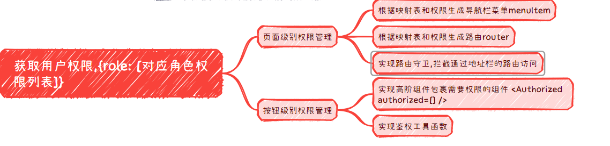
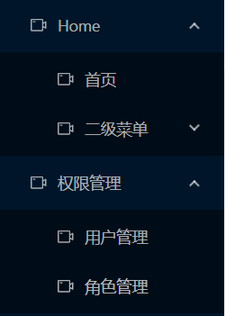
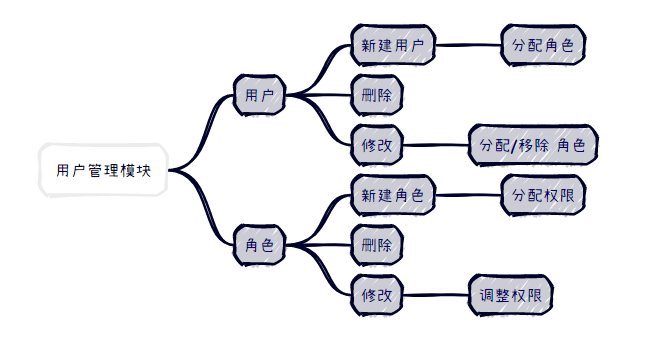
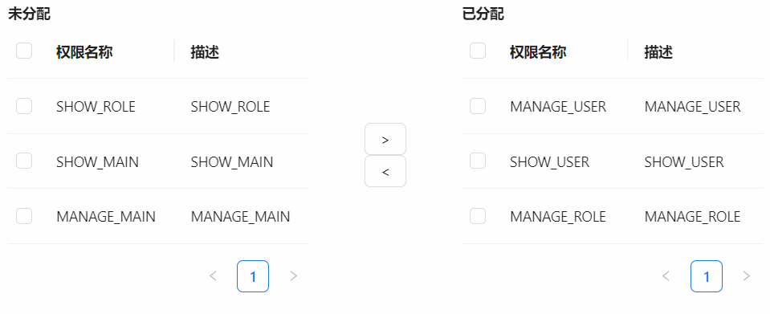

## 基于RBAC模型实现前端权限管理

> RBAC(Role-Based Access Control)基于角色的访问控制,通过角色将用户和权限联系起来,权限不直接分配给用户,而是分配给角色,每个角色便是一个权限集,一个用户可以拥有多个角色

接下来从前端的角度基于最基础的RBAC0实现一下前端的权限控制:

## 前端权限分析

项目中前端的权限大致分为两种:`访问权限`和`操作权限`,在开发时这两种权限可以在页面级和组件级分别进行实现:

- 页面级: 
  - 根据用户权限生成对应的路由来实现访问权限的控制
  - 实现路由守卫,拦截直接通过地址栏的路由访问
- 组件级: 
  - 通过鉴权高阶组件来实现操作和访问权限的控制
  - 或者通过鉴权工具函数进行访问和操作限制



## 前端权限实现

> 这里就不重新起项目了,使用上篇博文中的[demo项目](https://juejin.cn/post/7322037150425464844)

### 前置工作

#### 路由结构设计

这一步主要是避免重复配置路由表和导航菜单表,因为导航菜单和路由表的结构很类似,可以通过一个配置表来包含路由表和导航菜单表的信息,之后写两个方法分别将`routes`信息和`menu`信息提取出来即可,这里使用`antd的Menu组件`和`react的路由表`结合设计配置表,先看一下这两个表的必要结构:

```js
导航栏配置:
MenuItem {
  label: React.ReactNode,
  key: React.Key,
  icon?: React.ReactNode,
  children?: MenuItem[],
}

路由表配置:
RouteItem {
    path: string,
    element: JSX.Element,
    children?: RouteItem[]
}
```

想要的菜单栏结构大概是这样:



那么配置表可以这样设计:

```js
MenuAndRouteItem {
    name?: string, // 菜单栏名称,
    icon?: JSX.Element, // 菜单图标
    path?: string,      // 对应路由路径
    element?: JSX.Element,// 路由对应组件
    children?:RouteItem[], // 子路由,不出现在导航菜单中
    authority?: string[],  // 访问路由所需权限 
    menuItems?: MenuAndRouteItem[] // 子级导航,具有该属性时,表示当前层级是一个父级导航,此时配置path和element无效
}
```

根据这个结构配置好后,通过方法递归生成所需要的路由配置,来个`getRoutes`方法,将路由提取出来:

```js
export function getRoutes(routeMenuMap) {
  return routeMenuMap.reduce((acc, curr) => {
    if (curr.menuItems) { // 表示这一级是菜单,将其routes加入路由表中
      acc.push(...getRoutes(curr.menuItems));
        
    } else { // 表示这一级是路由,提取路由信息放入路由表中
      acc.push({
        path: curr.path,
        element: curr.element,
        authority: curr.authority || '',
        children: curr.children ? getRoutes(curr.children) : []
      });
    }
    return acc;
  }, []);
}
```

接下来就是将路由分为两类: 

- 与导航菜单对应的路由: 使用上述配置表的结构`MenuAndRouteItem`进行配置

- 不与导航菜单对应的路由: 按照正常的`route`结构来配置

  感觉能实现,实操一下试试:

```js
目录结构: 
routes         
├─ index.tsx   // 不需要出现在导航栏中的路由表
└─ menuRoutes.tsx  // 配置表,结合了路由和导航栏的配置
```

`menuRoutes.tsx:`

```js
...

// 路由和侧边栏菜单由此生成
const routeMenuMap = [
  {
    name: 'Home',
    icon: <VideoCameraOutlined />,
    menuItems: [
      {
        name: '首页',
        icon: <VideoCameraOutlined />,
        path: '/main',
        element: Main
      },
      {
        name: '二级菜单',
        icon: <VideoCameraOutlined />,
        menuItems: [
          {
            name: '组件级权限示例',
            path: '/authDemo',
            element: AuthDemo
          }
        ]
      }
    ]
  },
  {
    name: '权限管理',
    icon: <VideoCameraOutlined />,
    menuItems: [
      {
        name: '用户管理',
        icon: <VideoCameraOutlined />,
        path: '/user',
        element: User,
        authority: ['SHOW_USER', 'MANAGE_USER']
      },
      {
        name: '角色管理',
        icon: <VideoCameraOutlined />,
        path: '/role',
        element: Role,
        authority: ['SHOW_ROLE', 'MANAGE_ROLE']
      }
    ]
  }
];

export default routeMenuMap;
```

`index.tsx:`

```js
...
import routes, { getRoutes } from './routes';
....
// 其他不需要出现在导航栏中的路由直接在这里配置
const baseRoutes = [
  {
    path: '/',
    element: LoginLayout,
    children: [
      {
        path: '/login',
        element: Login
      }
    ]
  },
  {
    path: '/',
    element: BaseLayout,
    children: [
      ...getRoutes(routes),
      {
        path: '*', // 兜底路由
        element: <Navigate to="/main" />
      }
    ]
  }
];
export default createHashRouter(baseRoutes);
```

ok,目前路由这块提前工作就结束了,还差获取导航菜单的方法,这个先留着,到后面实现导航栏权限的时候一起做,

#### 获取用户权限

当用户登录成功后,携带`token`请求该用户所具有的权限,并保存在`localStorage`和`store`中,便于实现接下来的权限控制,这里假设后端传回的权限列表长这样:

```js
SHOW_xxx: 访问
MANAGE_XXX:操作
[
  "SHOW_USER",
  "MANAGE_USER",
  "SHOW_ROLE",
  "MANAGE_ROLE",
]
```

#### 封装鉴权函数

现在有了用户的权限列表,便可以根据这个权限列表来实现一个公共鉴权函数,在之后的各种鉴权场景中使用.对于这个函数的实现先分析一波,这个函数核心功能应该是将用户权限和所需权限进行比较,接收两个参数: 所需权限`authorize`和用户当前所拥有的权限`current`然后进行比较,最终返回一个表示是否通过的`Boolean`值:

common/pernission.ts:

```js
/**
 * @message: 鉴权
 * @param {string | string[]} authorize 所需权限 类型包含: 单个权限,或: ['||',"权限1","权限2"],与: [权限1","权限2"]
 * @param {string[]} current   当前有的权限
 * @return {Boolean}
 */
export function checkPermission(authorize: string | string[] = '', current: string[] | string = '') {
  if (authorize === '') {
    return true;
  }
  const required = paramToOneType(authorize);

  if (required[0] === '||') {
    required.splice(0, 1);
    return required.some(item => current.includes(item));
  }
  return required.every(item => current.includes(item));
}

function paramToOneType(param: string | string[]) {
  let arr = [];
  // 参数归一化
  if (typeof param === 'string') {
    arr.push(param);
  } else {
    arr = param;
  }
  return arr;
}
```

### 实现页面级权限控制

#### 生成路由

一切准备妥当,先根据权限生成一下路由,首先明确我们需要什么:

- 根据用户的权限只生成用户具有权限访问的路由
- 当store中用户的权限列表变化时及时重新生成路由,保证用户登录后就能生成对应的路由

使用hooks来实现非常合适:

/hooks/usePernissionRouter.tsx:

```js
import { checkPermission } from '@/common/pernission';
import { rootStore } from '@/stores';
import { useMemo } from 'react';
import { useSelector } from 'react-redux';

/**
 * @message: 根据路由和权限生成符合权限的路由
 * @param {string} role
 * @param {any} routers
 */
function checkRoutes(role: string[], routers: any) {
  return routers.reduce((acc: any, curr: any) => {
    const isPass = checkPermission(curr.authority, role);
    if (isPass) {
      const hasChildren = curr.children && curr.children.length > 0;
      if (hasChildren) {
        acc.push({ ...curr, children: checkRoutes(role, curr.children) });
      } else {
        acc.push(curr);
      }
    }
    return acc;
  }, []);
}
const usePernissionRouter = routers => {
  const user = useSelector((state: rootStore) => state.user);

  const r = useMemo(() => {
    return { ...routers, routes: checkRoutes(user.role, routers.routes) };
  }, [routers, user.role]);

  return r;
};
export default usePernissionRouter;
```

hook写好了,需要在原来使用router的地方替换一下:

APP.tsx:

```js
import usePernissionRouter from './hooks/usePernissionRouter';
import routers from '@/routes';

function App() {
  const r = usePernissionRouter(routers);
  return (
    <>
      <React.StrictMode>
        <RouterProvider router={r} />
      </React.StrictMode>
    </>
  );
}
```

#### 生成导航菜单

路由权限搞定之后,来实现一下导航菜单的权限控制,与实现路由的思路一致,封装生成导航菜单的hook:

`/hooks/usePernissionMenu.tsx:`

```js
import { rootStore } from '@/stores';
import { useMemo } from 'react';
import { useSelector } from 'react-redux';
import { checkPermission } from '@/common/pernission';

interface menuItem {
  name: string;
  icon: React.ReactElement;
  path?: string;
  element?: React.ReactElement;
  authority?: string[];
  menuItems?: menuItem[];
}
/**
 * @message: 根据路由和权限生成对应的menu
 * @param {any} role
 * @param {any} routes
 */
function checkMenu(role: string[], routes: menuItem[] = []) {
  return routes.reduce((acc: any, curr: menuItem) => {
    // 表示这一级是导航
    const isParentMenu = curr.menuItems && curr.menuItems.length > 0;
    let menu;
    if (isParentMenu) {
      menu = createParentMenu(role, curr);
    } else {
      menu = createSonMenu(role, curr);
    }
    menu && acc.push(menu);
    return acc;
  }, []);
}

function createParentMenu(role: string[], currMenu: menuItem) {
  const passItems = checkMenu(role, currMenu.menuItems);
  const hasPassItem = passItems.length > 0;
  if (hasPassItem) {
    return {
      label: currMenu.name,
      key: currMenu.path || currMenu.name,
      icon: currMenu.icon,
      children: passItems
    };
  }
}

function createSonMenu(role: string[], curr: menuItem) {
  const isPass = checkPermission(curr.authority, role);
  if (isPass) {
    return {
      label: curr.name,
      key: curr.path || curr.name,
      icon: curr.icon
    };
  }
}

const usePernissionMenu = routes => {
  const user = useSelector((state: rootStore) => state.user);

  const menus = useMemo(() => {
    return checkMenu(user.role, routes);
  }, [user.role, routes]);

  return menus;
};

export default usePernissionMenu;
```

接下来只需要在layout中引入使用即可:

```js
import routes from '@/routes/menuRoutes';
const menu = usePernissionMenu(routes);
const menuClick = ({ key }: { key: string }) => {
    navigate(key);
};
...
    <Menu
      theme="dark"
      mode="inline"
      items={menu}
      onClick={menuClick}
    />
...
```

#### 路由守卫

到这里,正常的访问便可以进行限制了,但当用户在登录页地址栏直接输入主页路由的时候,依然能跳转过去,因此还需要在路由进入时进行拦截鉴权.实现一下路由守卫即可:

- 写一个高阶组件,对整个baseLayout进行包装,如果是未登录的状态就跳转到登录页
- 高阶组件中监听`location.pathname`的变化

`/components/routerBeforeEach/index.tsx:`

```js
import { isLogin } from '@/common';
import logout from '@/common/logout';
import { useEffect } from 'react';
import { useLocation } from 'react-router-dom';

interface RouterBeforeEachProps {
  children?: React.ReactNode;
}
/**
 * @message: 通过监听location.pathname的变化来进行鉴权
 */
const RouterBeforeEach = <P extends object>(Comp: React.FC<P>) => {
  const Component = (props: P & RouterBeforeEachProps) => {
    const { children, ...rest } = props;
    const location = useLocation();
    useEffect(() => {
      if (!isLogin()) {
        logout();
      }
    }, [location.pathname]);
    return <Comp {...(rest as P)}>{children}</Comp>;
  };
  return Component;
};

export default RouterBeforeEach;
```

在`baseLayout`中使用:

```js
export default RouterBeforeEach(BaseLayout)
```

### 实现组件级权限控制

组件级权限控制就比较好实现了:

- 通过鉴权函数,如果没有权限不渲染这个组件即可,
- 通过高阶组件对原组件进行包装

实现以下高阶组件:

`/components/authorized/index.tsx:`

```js
import { checkPermission } from '@/common/pernission';
import { rootStore } from '@/stores';
import { useSelector } from 'react-redux';

interface AuthCompProps {
  authority: string | string[];
  children?: React.ReactNode;
}

/**
 * @message: 权限校验高阶组件,返回一个附带校验功能的组件
 */
const Authorized = <P extends object>(Component: React.FC<P>) => {
  const AuthComponent = (props: P & AuthCompProps) => {
    const user = useSelector((state: rootStore) => state.user);
    const { authority, children, ...rest } = props;

    if (checkPermission(authority, user.role)) {
      return <Component {...(rest as P)}>{children} </Component>;
    }
    return null;
  };
  return AuthComponent;
};

export default Authorized;
```

包装一个具有权限校验功能的按钮:

```js
import Authorized from '@/components/authorized';
import { Button } from 'antd';

const AddUserButton = Authorized(Button);
...
<AddUserButton authority="MANAGE_USER">具有MANAGE_USER权限的用户可以看到</AddUserButton>
...
```

## 前端权限管理模块

从超级管理员的视角分析权限控制的整体流程:

1. 输入用户名和密码创建一个新用户
2. 为新用户分配角色
   1. 使用已有角色分配给新用户
   2. 若已有角色不满足需求
      1. 创建新角色
      2. 为新角色分配权限
      3. 将该角色分配给用户
3. 最后保存,便实现了一个用户的创建及权限分配

从上述流程可以分析出系统中用户管理模块应具备以下功能:



### 实现权限/角色分配组件

理顺了功能,发现除了增删改查之外,可以将分配权限/角色的功能单独抽取出来,避免过多的重复逻辑,

写代码之前还是先分析一波:该组件的功能主要实现一个数据互换,就叫`TransferList`吧,我希望这个组件左边可以展示所有的权限/角色,右边可以展示当前用户的权限/角色.然后中间有两个按钮,可以将左右两边选中的项进行互相移动,以此来完成权限/角色的添加和移除.

UI层面: 左右两边就用表格来展示数据,中间放两个按钮来实现数据互换

接口层面: 组件props

```js
interface Item {
  key: string;
  [otherProperty: string]: any;
}

interface PropsType {
  columns: ColumnType<Item>[]; // 左右表格列
  onChange: (newLeft: Item[], newRight: Item[]) => void; // 交换数据时的回调,将交换后的数据返回给外面使用
  leftData: Item[]; // 左侧表格数据源
  rightData: Item[]; // 右侧表格数据源
  table?: Omit<TableProps<Item>, 'dataSource' | 'columns'>; // 左右表格其他配置
}
```

大体框架已经有了,来具体实现一下:

```js
// 数据交换组件
/*
interface PropsType {
  columns: 表格列配置,左右表格共用一个,同antd
  table?: 表格其他配置,同antd
  onChange: 点击数据左移/右移触发回调,参数为移动后的数据
  leftData: 左侧表格数据
  rightData: 右侧表格数据
}
*/

import { Button, Table } from 'antd';
import styles from './index.module.less';
import { useState } from 'react';
import { ColumnType, TableProps } from 'antd/es/table';

interface Item {
  key: string;
  [otherProperty: string]: any;
}

interface PropsType {
  columns: ColumnType<Item>[];
  onChange: (newLeft: Item[], newRight: Item[]) => void;
  leftData: Item[];
  rightData: Item[];
  table?: Omit<TableProps<Item>, 'dataSource' | 'columns'>;
}

function isItemInArr(arr: Item[], item: Item) {
  return arr.reduce((acc, curr) => {
    if (curr.key === item.key) {
      acc = true;
    }
    return acc;
  }, false);
}
// 将current,target存的元素从将current中去除,并返回新的将current
function removeSameObj(current: Item[], target: Item[]): Item[] {
  return current.reduce((acc: Item[], curr) => {
    if (!isItemInArr(target, curr)) {
      acc.push(curr);
    }
    return acc;
  }, []);
}

const TransferList: React.FC<PropsType> = ({ columns, onChange, leftData, rightData, table = {} }) => {
  const [leftSource, setLeftSource] = useState(removeSameObj(leftData, rightData));
  const [rightSource, setRightSource] = useState(rightData);
  const [leftRows, setLeftRows] = useState<Item[]>([]);
  const [rightRows, setRightRows] = useState<Item[]>([]);
  const [leftKeys, setLeftKeys] = useState<React.Key[]>([]);
  const [rightKeys, setRightKeys] = useState<React.Key[]>([]);

  const leftChange = (newSelectedRowKeys: React.Key[], selectedRows: Item[]) => {
    setLeftKeys(newSelectedRowKeys);
    setLeftRows(selectedRows);
  };
  const rightChange = (newSelectedRowKeys: React.Key[], selectedRows: Item[]) => {
    setRightRows(selectedRows);
    setRightKeys(newSelectedRowKeys);
  };

  const leftClick = () => {
    if (leftRows.length === 0) {
      return;
    }
    const newRight = [...rightSource, ...leftRows];
    const newLeft = removeSameObj(leftSource, leftRows);
    setRightSource(newRight);
    setLeftSource(newLeft);
    onChange(newLeft, newRight);
    clearSelected();
  };
  const rightClick = () => {
    if (rightRows.length === 0) {
      return;
    }
    const newLeft = [...leftSource, ...rightRows];
    const newRight = removeSameObj(rightSource, rightRows);
    setLeftSource(newLeft);
    setRightSource(newRight);
    onChange(newLeft, newRight);
    clearSelected();
  };

  const rowLeftSelection = {
    selectedRowKeys: leftKeys,
    onChange: leftChange
  };
  const rowRightSelection = {
    selectedRowKeys: rightKeys,
    onChange: rightChange
  };
  function clearSelected() {
    setRightRows([]);
    setRightKeys([]);
    setLeftRows([]);
    setLeftKeys([]);
  }
  return (
    <>
      <div className={styles.wrap}>
        <div className={styles.left}>
          <h4>未分配</h4>
          <Table
            rowSelection={rowLeftSelection}
            columns={columns}
            dataSource={leftSource}
            {...table}
          />
        </div>
        <div className={styles.middle}>
          <Button onClick={leftClick}>{'>'}</Button>
          <Button onClick={rightClick}>{'<'}</Button>
        </div>
        <div className={styles.right}>
          <h4>已分配</h4>
          <Table
            rowSelection={rowRightSelection}
            columns={columns}
            dataSource={rightSource}
            {...table}
          />
        </div>
      </div>
    </>
  );
};

export default TransferList;
```

传点参数来看一下效果:

```js
<TransferList
  columns={transferListcolumns}
  onChange={onChange}
  leftData={leftData}
  rightData={rightData}
/>
```

页面查看一下效果:



好了,这个基础`demo`的 主要步骤都实现了,完整源码地址[在这里](https://github.com/LAF523/login-permission-demo)

## 总结一下

权限控制的核心思想: 将用户所拥有的权限和操作所需权限进行比较判断

前端实现权限控制可以从`页面`和`组件`两个层级进行实现:

- 页面级: 主要是限制访问权限
  - 路由: 根据用户权限生成路由
  - 导航: 根据用户权限生成就导航菜单
  - 地址栏: 实现路由守卫,拦截未登录的跳转
- 组件级: 访问和操作权限都可以限制
  - 鉴权高阶组件,将普通组件包装为具有权限检验功能的组件


