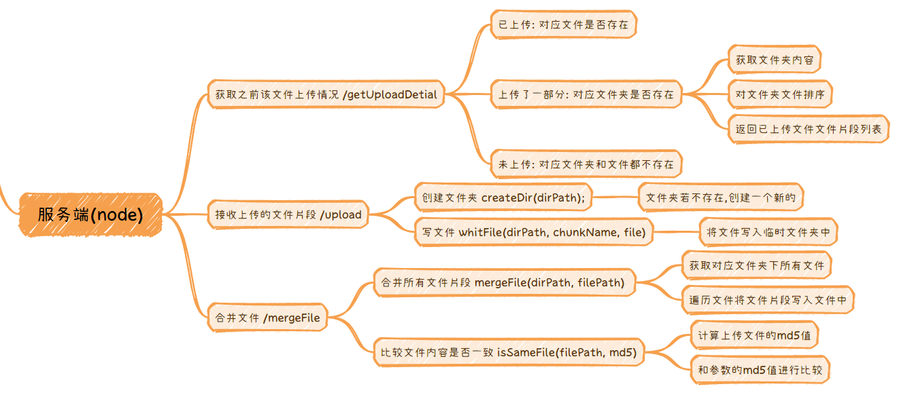
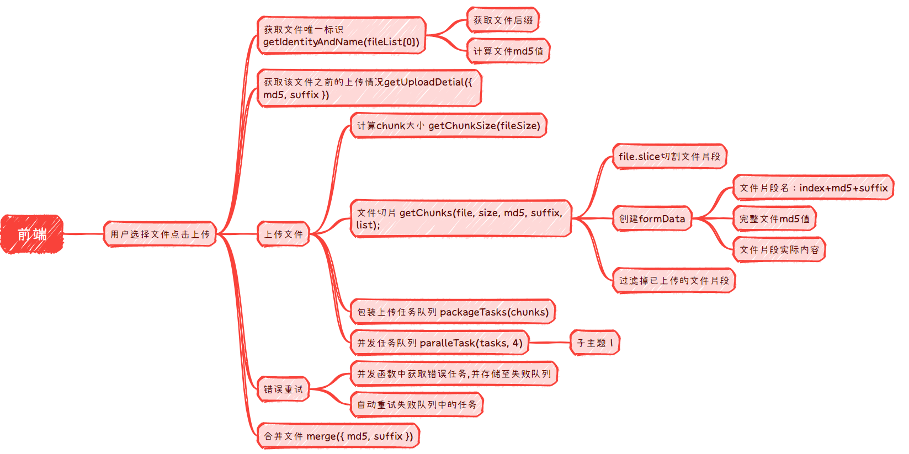

# 大文件上传

## 前置知识

### FormData

[formData相关知识点](https://juejin.cn/post/7339544833998946330)

### MD5

根据文件内容映射成唯一的值,主要作用:

- 用于标识文件,
- 保证文件完整性: 确保文件传输前后文件的一致性

使用`spark-md5`这个库可以快速获取文件的`md5`值

#### 安装

```js
npm install --save spark-md5
```

#### 使用

```js
    return new Promise((resolve, reject) => {
      const fileReader = new FileReader();
      fileReader.readAsArrayBuffer(file);
      fileReader.onload = e => {
        const buffer = e.target?.result;
        const spark = new SparkMD5.ArrayBuffer();
        spark.append(buffer as ArrayBuffer);
        const md5 = spark.end();
        resolve({ md5 });
      };
        fileReader.onerror = function (error) {
          reject(error);
        };
      };
    });
}
```

# 正文

> 完整demo地址为[github](https://link.juejin.cn/?target=https%3A%2F%2Fgithub.com%2FLAF523%2Flogin-token-permission-demo.git)

大文件分片上传主要有两个优点: `降低单个请求的数据量`和`断点续传,避免因外界原因上传失败导致重新上传`,接下来使用`node`和`react`,完整实现一下大文件上传的整体流程:

- 用户选择文件
- 检查文件是否上传过
- 大文件分片上传
- 文件合并

## 服务端



#### 文件夹规划

存储文件的文件夹结构设计成这样: 上传文件片段时,新建临时文件夹进行存放.合并文件时,将临时文件夹中的文件片段合并成一个合并后删除临时文件夹.临时文件夹的存在还能实现断点续传功能

```js
file                                          
├─ 4bc9f5f5a21b3cde7fec7b954de51c7a  // 一个临时文件夹,用来存放文件片段,以完整文件的md5命名便于和完整文件对应         
│  └─ 0-4bc9f5f5a21b3cde7fec7b954de51c7a.png
│  └─ 1-4bc9f5f5a21b3cde7fec7b954de51c7a.png   // 文件片段命名以片段索引开头,便于合并文件时排序
├─ 4bc9f5f5a21b3cde7fec7b954de51c7a.png        // file内存放合并好的完整文件                                
```

#### getUploadDetial接口

为了避免不必要的上传,前端上传文件时需要先检查这个文件之前的上传情况,接收两个参数`完整文件的md5`和`文件后缀suffix`,响应已上传文件片段列表`list`:

1. 检查对应文件是否存在于`file`中,存在表示已经上传过了,直接返回上传成功`list = []`
2. 对应文件不存在,检查对应临时文件夹是否存在,存在表示上传了一部分,可以断点续传.返回文件夹内文件片段组成的列表`list =[片段1,片段2...]`,
3. 未上传: 上述两种情况都不满足,则表示这个文件没有上传过,响应空的`list`

ok,先来把这个接口实现一下:

```js
/**
 * @message: 检查文件之前上传情况: 未上传,上传一部分,已上传
 * @param {*} md5 完整文件唯一标识
 * @param {*} suffix 文件后缀
 * @response {data: array,success: boolean,err: any}
 */
router.get("/getUploadDetial", (req, res) => {
  const { md5, suffix } = req.query;
  let list = [];
  let data = { isUploaded: false, list };
  const { filePath, dirPath } = getDirPathAndFilePath(md5, suffix);

  const isUploaded = fs.existsSync(filePath);
  if (isUploaded) {
    data = { ...data, isUploaded };
  }

  const isUploading = fs.existsSync(dirPath);
  if (isUploading) {
    list = fs.readdirSync(dirPath); // 获取已上传的文件片段
    list = sortFiles(list);
    data = { ...data, list };
  }

  res.send({
    data,
    err: null,
    success: true,
  });
});
function getDirPathAndFilePath(md5, suffix) {
  const dirPath = path.join(UPLOAD_DIR, `./${md5}`);
  const filePath = path.join(UPLOAD_DIR, `./${md5}.${suffix}`);
  return { dirPath, filePath };
}
```

### upload接口

前端拿到上传情况后,接下来就要上传文件片段了,这个接口的主要作用就是将文件片段存储在临时文件夹中.

文件发送时前端使用的`FormData`,因此需要一个解析表单的库,这里使用`multiparty`库,先安装一下:

```js
npm i multiparty -S
```

接口接收参数: `md5文件标识,suffix文件后缀,chunkName文件名,file文件内容`(有些参数可以通过正则去切,这里为了方便,直接让前端传递了),响应成功或者失败:

1. 解析参数
2. 创建临时文件夹
3. 将文件写入文件夹

```js
/**
 * @message: 文件片段以index-MD5.suffix命名保存在md5命名的文件夹中
 * @param {*} md5 完整文件唯一标识
 * @param {*} chunkName 当前文件片段名称
 * @param {*} suffix 文件后缀
 * @param {*} file 文件片段内容
 */
router.post("/upload", (req, res) => {
  const form = new multiparty.Form();
  let isSuccess = false;
  let err = null;

  form.parse(req, async (error, fields, files) => {
    if (error) {
      err = error;
    } else {
      isSuccess = await saveFile(fields, files);
    }

    res.send({
      success: isSuccess,
      err,
      data: null,
    });
  });
});

async function saveFile(fields, files) {
  const { md5, chunkName, suffix } = fields;
  const { dirPath, filePath } = getDirPathAndFilePath(md5, suffix);
  const hasFile = fs.existsSync(filePath);
  if (!hasFile) {
    createDir(dirPath);
    return await whitFile(dirPath, chunkName, files.file[0]);
  }
  return true;
}

function createDir(dirPath) {
  const hasDir = fs.existsSync(dirPath);
  if (!hasDir) {
    fs.mkdirSync(dirPath);
  }
}

function whitFile(dirPath, chunkName, file) {
  return new Promise((resolve, reject) => {
    const fragmentPath = path.join(dirPath, `./${chunkName}`);
    const buffer = fs.readFileSync(file.path);
    fs.writeFile(fragmentPath, buffer, (err) => {
      if (err) {
        resolve(false);
      }
      resolve(true);
    });
  });
}
```

### mergeFile接口

文件写入完毕,之后需要将文件片段合成一个文件,实现方式有很多种,可以后端判断文件索引,自动进行合并.也可以让前端发送请求合并,这里使用的是后者.

为了知道需要合并哪个文件夹的文件,该接口需要两个参数`完整文件的md5`和`文件后缀suffix`,接下来就是:

- 读取对应的临时文件夹
- 将文件片段按照前缀索引的顺序
- 依次追加到一个文件中
- 判断合并后的文件的md5值和参数md5值是否相同以保证文件的完整性

实现一下:

```js
/**
 * @message: 合并md5命名文件夹内所有文件,并删除该文件夹,合并后检查文件的md5是否一致
 * @param {*} md5 完整文件唯一标识
 * @param {*} suffix 文件后缀
 */
router.get("/mergeFile", async (req, res) => {
  const { md5, suffix } = req.query;
  const { dirPath, filePath } = getDirPathAndFilePath(md5, suffix);

  mergeFile(dirPath, filePath);

  const isSame = await isSameFile(filePath, md5);
  if (!isSame) {
    fs.unlinkSync(filePath);
    res.send({ success: false, err: "文件已经损坏请重新上传!", data: null });
    return;
  }

  res.send({ success: true, err: null, data: null });
});

function mergeFile(dirPath, filePath) {
  let list = fs.readdirSync(dirPath);
  list = sortFiles(list);
  list.forEach((item) => {
    const chunkPath = path.join(dirPath, item);
    const buffer = fs.readFileSync(chunkPath);
    fs.appendFileSync(filePath, buffer);
    fs.unlinkSync(chunkPath);
  });
  fs.rmdirSync(dirPath);
}
function sortFiles(list) {
  list.sort((a, b) => {
    const aRes = a.match(/^(\d+)-(.+)$/);
    const bRes = b.match(/^(\d+)-(.+)$/);
    return aRes[1] - bRes[1];
  });
  return list;
}

async function isSameFile(filePath, md5) {
  let currMd5 = await getMd5byFile(filePath);
  return currMd5 === md5;
}

function getMd5byFile(filePath) {
  return new Promise((resolve, reject) => {
    const readStream = fs.createReadStream(filePath);
    const hash = crypto.createHash("md5");

    readStream.on("data", (chunk) => {
      hash.update(chunk);
    });
    readStream.on("end", () => {
      const fileMd5 = hash.digest("hex");
      resolve(fileMd5);
    });
    readStream.on("error", (err) => {
      reject(err);
    });
  });
}
```

## 前端

后端的接口差不多了,接下来做一下前端:



### 构建页面

使用`antd`的`upload`组件简单把页面构建一下:

```js
const UploadButton: React.FC = () => {
  const [fileList, setFileList] = useState<UploadFile[]>([]);
  const [uploading, setUploading] = useState(false);

  const handleUpload = async () => {
      
  };

  const props: UploadProps = {
    onRemove: file => {
      const index = fileList.indexOf(file);
      const newFileList = fileList.slice();
      newFileList.splice(index, 1);
      setFileList(newFileList);
    },
    beforeUpload: file => {
      setFileList([file]);
      return false;
    },
    fileList
  };

  return (
    <>
      <Upload {...props}>
        <Button icon={<UploadOutlined />}>Select File</Button>
      </Upload>
      <Button
        type="primary"
        onClick={handleUpload}
        disabled={fileList.length === 0}
        loading={uploading}
        style={{ marginTop: 16 }}
      >
        {uploading ? 'Uploading' : 'Start Upload'}
      </Button>
    </>
  );
};

export default UploadButton;

```

主要就是在`handleUpload`中做文章了

#### 命名约定

先把文件片段命名格式约定一下,为了保证文件片段的顺序以及与源文件的关系: `索引-md5值.文件后缀`

#### api封装

然后将接口封装一下下方便接下来使用:

`service`下新建`upload.ts`:

```js
import { get, post } from './http';

// 开始上传时获取上传详情
export const getUploadDetial = (data: { md5: string; suffix: string }) => get('/api/getUploadDetial', data);

//上传分片
export const upload = data => post('/api/upload', data, { headers: { 'Content-Type': 'multipart/form-data' } });

// 合并文件
export const merge = data => {
  return get('/api/mergeFile', data);
};
```

### 获取文件信息

正式开始: 首先需要将文件的`md5`和`后缀suffix`获取到,方便和后端的交互:

```js
/**
* @message:获取文件md5和后缀
* @param file
* @return {md5: string,suffix: string} 
*/
function getIdentityAndName(file){
    return new Promise((resolve, reject) => {
      const suffix = file.name.split('.')[1];

      const fileReader = new FileReader();
      fileReader.readAsArrayBuffer(file);
      fileReader.onload = e => {
        const buffer = e.target?.result;
        const spark = new SparkMD5.ArrayBuffer();
        spark.append(buffer as ArrayBuffer);
        const md5 = spark.end();
        resolve({ md5, suffix });
      };
      fileReader.onerror = () => {
        fileReader.onerror = function (error) {
          reject(error);
        };
      };
    });
}
```

### 请求文件上传历史

通过`getUploadDetial`获取到上传过的文件片段,接下来上传的时候这些就不用上传了,如果整个文件已上传过了,那么也不需要上传了,这些分别就是: 断点续传,妙传

```js
const [data, err] = await getUploadDetial({ md5, suffix });
if (err) return message.success('上传失败!');
const { isUploaded, list } = data;
if (isUploaded) {
  return message.success('上传成功!');
}
```

### 文件上传

如果文件未上传完成,接下来就需要将文件分片并生成上传任务:

1. 计算文件片段大小`getChunkSize`,这里设置的默认大小是`1M`,如果分片超过一百,`size`将调整的大一些,保证不超过一百个文件片段

2. 构建文件片段数组`getChunks`,根据`size`,通过`file.slice`方法,将文件分片

3. 生成上传任务队列`packageTasks`,根据`chunk`数组生成上传任务队列

4. 并发执行上传任务,并控制最大并发数`paralleTask`

流程分析好了,挨个实现一下:

`getChunkSize:获取片大小`

```js
function getChunkSize(fileSize: number) {
    const defaultSize = 1 * 1024 * 1024; // 每片1M
    const defaultCount = 100;
    const maxCount = Math.ceil(fileSize / defaultSize);
    const maxSize = Math.ceil(fileSize / defaultCount);
    return maxCount > defaultCount ? maxSize : defaultSize;
  }
```

`getChunks:获取分片`

```js
function getChunks(file, size: number, md5: string, suffix: string, list: string[]) {
    let index = 0;
    const end = Math.ceil(file.size / size);
    const result = [];
    while (index < end) {
      const chunk = file.slice(index * size, (index + 1) * size);
      const chunkName = `${index}-${md5}.${suffix}`;
      if (!isUploadedFile(list, chunkName)) {
        const formData = new FormData();
        formData.append('file', chunk);
        formData.append('md5', md5);
        formData.append('chunkName', chunkName);
        result.push(formData);
      }

      index++;
    }
    return result;
}
```

`packageTasks: 包装任务队列`

```js
function packageTasks(chunks: FormData[]) {
    return chunks.map(item => {
      return upload.bind(null, item);
    });
}
```

`paralleTask: 并发执行任务,控制任务并发数`

```js
const paralleTask = (tasks: any[], max = 4) => {
  if (tasks.length === 0) return;

  return new Promise((resolve, reject) => {
    let nextIndex = 0;
    let finishedIndex = 0;
    const len = tasks.length;
    for (let i = 0; i < max && i < len; i++) {
      _run();
    }

    function _run() {
      const task = tasks[nextIndex];
      nextIndex++;
      task()
        .then(() => {
          finishedIndex++;
          const isFinied = finishedIndex === len;
          if (isFinied) {
            resolve(0);
          }

          const hasTask = nextIndex < len;
          if (hasTask) {
            _run();
          }
        })
        .catch((err: any) => reject(err));
    }
  });
};
```

### 文件合并

上传完毕,就可以发送合共请求了:

```js
await merge({ md5, suffix });
```

### 组合流程

方法定义完毕,最后在`handleUpload`方法中,将步骤组合起来即可:

```js
  const handleUpload = async () => {
    setUploading(true);
    const { md5, suffix } = await getIdentityAndName(fileList[0]);

    const [data, err] = await getUploadDetial({ md5, suffix });
    if (err) return message.success('上传失败!');
    const { isUploaded, list } = data;
    if (isUploaded) {
      setUploading(false);
      return message.success('上传成功!');
    }

    const file = fileList[0];
    const size = getChunkSize(file.size as number);
    const chunks = getChunks(file, size, md5, suffix, list);
    const tasks = packageTasks(chunks);
    await paralleTask(tasks, 4);
    await merge({ md5, suffix });
    setUploading(false);
  };
```

### 失败重试机制

根据应用场景而异,完善的上传失败处理逻辑相当复杂,涉及前后端甚至数据库等很多方面,这里就`上传过程中某个文件片上传失败的场景`简单的聊一下个人做法:

简单来说就是`增加重试机制`,给`paralleTask`新增一个回调参数`callback`,有了这个函数,我们就能拿到任务的执行情况包括: `当前任务,当前任务的执行结果,完成任务个数等`借此可以实现很多事情,比如上传进度条等

言归正传,继续说重试机制: 通过这个回调函数记录失败的任务,并保存在失败任务队列中,当所有的文件片上传完毕后,先检查失败队列中是否有任务,如果有就进行指定`n`次的`retry`,直到错误队列为空或到达指定次数,

思路就是这样,接下来一步步实现一下:

1. 首先准备一个错误队列`errTask`,

   ```js
   upload.tsx: 
   
   const errTasks: (() => Promise<any>)[] | [] = [];
   ```

2. 给执行并发任务的函数`paralleTask`,新增一个参数`callback`

   ```js
   upload.tsx: 
   
   type CallBackprops = {
     res: any[]; // 结果数组
     finishedIndex: number; // 已完成任务的数量
     nextIndex: number; // 下一个要执行的任务的索引
     task: () => Promise<any>; // 当前正在执行的任务
   };
   type TaskCallback = (info: CallBackprops) => void;
   
   const paralleTask = (tasks: (() => Promise<any>)[] | [], max = 4, callback?: TaskCallback) => {
     if (tasks.length === 0) return;
   
     return new Promise(resolve => {
       let nextIndex = 0;
       let finishedIndex = 0;
       const len = tasks.length;
       for (let i = 0; i < max && i < len; i++) {
         _run();
       }
   
       function _run() {
         const task = tasks[nextIndex];
         nextIndex++;
         task().then((data: any) => { // 封装的axios,无论请求失败或成功都会走resolve,所以只需在这个回调中处理即可
           finishedIndex++;
           callback && callback({ res: data, finishedIndex, nextIndex, task }); // 将任务相关情况暴露出去
   
           const isFinied = finishedIndex === len;
           if (isFinied) {
             resolve(0);
           }
   
           const hasTask = nextIndex < len;
           if (hasTask) {
             _run();
           }
         });
       }
     });
   };
   ```

3. 构建`callback`函数,记录错误任务

   ```js
   upload.tsx:
   
   function callBack({ res, task }: CallBackprops) {
       const err = res[1];
       if (err) {
         errTasks.push(task);
       }
   }
   ```

4. 构建重试机制`retry`

   ```js
   upload.tsx:
   
   async function retry(maxRetry: number) {
       let currRetry = 0;
       while (errTasks.length > 0 && currRetry < maxRetry) {
         const len = errTasks.length;
         await paralleTask(errTasks.splice(0, len), 4, callBack); // 调用并发任务函数重新执行上次出错的并发任务
         currRetry++;
       }
   }
   ```

5. 修改原来上传逻辑,在第一次执行完上传时进行重试

   ```js
   upload.tsx:
   
   ...
       const chunks = getChunks(file, size, md5, suffix, list);
       const tasks = packageTasks(chunks);
       await paralleTask(tasks, 4, callBack);
       await retry(2);// 设置重试两次
       const [_, mergeError] = await merge({ md5, suffix });
       if (mergeError) {
         message.success(mergeError);
       } else {
         message.success('上传成功');
       }
   ...
   ```

到此简单的重试机制就实现了,文件上传过程中出现错误就可以自动进行最多两次重试,实际上保险起见后端也应该设置一个定时任务,定期清理临时文件夹,防止不知情时产生的冗余垃圾文件,当然这都是后话了,具体还是跟着所在的业务场景来,

## 前后端完整代码

#### 前端:

`upload.tsx:`

```js
import React, { useState } from 'react';
import { UploadOutlined } from '@ant-design/icons';
import { Button, Upload, message } from 'antd';
import type { UploadFile, UploadProps } from 'antd';
import { getUploadDetial, upload, merge } from '@/service/upload.ts';
import SparkMD5 from 'spark-md5';
import { paralleTask, CallBackprops } from '@/common/index.ts';

const errTasks: (() => Promise<any>)[] | [] = [];
const UploadButton: React.FC = () => {
  const [fileList, setFileList] = useState<UploadFile[]>([]);
  const [uploading, setUploading] = useState(false);

  const props: UploadProps = {
    onRemove: file => {
      const index = fileList.indexOf(file);
      const newFileList = fileList.slice();
      newFileList.splice(index, 1);
      setFileList(newFileList);
    },
    beforeUpload: file => {
      setFileList([file]);
      return false;
    },
    fileList
  };

  const handleUpload = async () => {
    setUploading(true);
    const { md5, suffix } = await getIdentityAndName(fileList[0]);

    const [data, err] = await getUploadDetial({ md5, suffix });
    if (err) return message.success('上传失败!');
    const { isUploaded, list } = data;
    if (isUploaded) {
      setUploading(false);
      return message.success('上传成功!');
    }

    const file = fileList[0];
    const size = getChunkSize(file.size as number);
    const chunks = getChunks(file, size, md5, suffix, list);
    const tasks = packageTasks(chunks);
    await paralleTask(tasks, 4, callBack);
    await retry(2);
    const [_, mergeError] = await merge({ md5, suffix });
    if (mergeError) {
      message.success(mergeError);
    } else {
      message.success('上传成功');
    }
    setUploading(false);
  };

  function callBack({ res, task }: CallBackprops) {
    const err = res[1];
    if (err) {
      errTasks.push(task);
    }
  }
  async function retry(maxRetry: number) {
    let currRetry = 1;
    while (errTasks.length > 0 && currRetry < maxRetry) {
      const len = errTasks.length;
      await paralleTask(errTasks.splice(0, len), 4, callBack);
      currRetry++;
    }
  }

  function getIdentityAndName(file: any): { md5: string; suffix: string } {
    return new Promise((resolve, reject) => {
      const suffix = file.name.split('.')[1];

      const fileReader = new FileReader();
      fileReader.readAsArrayBuffer(file);
      fileReader.onload = e => {
        const buffer = e.target?.result;
        const spark = new SparkMD5.ArrayBuffer();
        spark.append(buffer as ArrayBuffer);
        const md5 = spark.end();
        resolve({ md5, suffix });
      };
      fileReader.onerror = error => {
        reject(error);
      };
    });
  }

  function getChunkSize(fileSize: number) {
    const defaultSize = 1 * 1024 * 1024; // 每片1M
    const defaultCount = 100;
    const maxCount = Math.ceil(fileSize / defaultSize);
    const maxSize = Math.ceil(fileSize / defaultCount);
    return maxCount > defaultCount ? maxSize : defaultSize;
  }

  function getChunks(file, size: number, md5: string, suffix: string, list: string[]) {
    let index = 0;
    const end = Math.ceil(file.size / size);
    const result = [];
    while (index < end) {
      const chunk = file.slice(index * size, (index + 1) * size);
      const chunkName = `${index}-${md5}.${suffix}`;
      if (!isUploadedFile(list, chunkName)) {
        const formData = new FormData();
        formData.append('file', chunk);
        formData.append('md5', md5);
        formData.append('chunkName', chunkName);
        result.push(formData);
      }

      index++;
    }
    return result;
  }
  function packageTasks(chunks: FormData[]) {
    return chunks.map(item => {
      return upload.bind(null, item);
    });
  }

  function isUploadedFile(list: string[], name: string) {
    return list.includes(name);
  }

  return (
    <>
      <Upload {...props}>
        <Button icon={<UploadOutlined />}>Select File</Button>
      </Upload>
      <Button
        type="primary"
        onClick={handleUpload}
        disabled={fileList.length === 0}
        loading={uploading}
        style={{ marginTop: 16 }}
      >
        {uploading ? 'Uploading' : 'Start Upload'}
      </Button>
    </>
  );
};

export default UploadButton;
```

`/common/index.ts:`

```js
export type CallBackprops = {
  res: any[]; // 结果数组
  finishedIndex: number; // 已完成任务的数量
  nextIndex: number; // 下一个要执行的任务的索引
  task: () => Promise<any>; // 当前正在执行的任务
};
export type TaskCallback = (info: CallBackprops) => void;

// 并发异步队列,控制异步任务的并发数
export const paralleTask = (tasks: (() => Promise<any>)[] | [], max = 4, callback?: TaskCallback) => {
  if (tasks.length === 0) return;

  return new Promise(resolve => {
    let nextIndex = 0;
    let finishedIndex = 0;
    const len = tasks.length;
    for (let i = 0; i < max && i < len; i++) {
      _run();
    }

    function _run() {
      const task = tasks[nextIndex];
      nextIndex++;
      task().then((data: any) => {
        finishedIndex++;
        callback && callback({ res: data, finishedIndex, nextIndex, task });

        const isFinied = finishedIndex === len;
        if (isFinied) {
          resolve(0);
        }

        const hasTask = nextIndex < len;
        if (hasTask) {
          _run();
        }
      });
    }
  });
};
```

#### 后端:

`router/upload.js`:

```js
const express = require("express");
const router = express.Router();
const fs = require("node:fs");
const path = require("node:path");
const crypto = require("node:crypto");
const multiparty = require("multiparty");

const UPLOAD_DIR = path.resolve(process.cwd(), "./file"); // 完整文件存放在file下,每个文件的片存在文件md5命名的文件夹下

/**
 * @message: 检查文件之前上传情况: 未上传,上传一部分,已上传
 * @param {*} md5 完整文件唯一标识
 * @param {*} suffix 文件后缀
 * @return {*} list 已上传文件片段名列表
 */
router.get("/getUploadDetial", (req, res) => {
  const { md5, suffix } = req.query;
  let list = [];
  let data = { isUploaded: false, list };
  const { filePath, dirPath } = getDirPathAndFilePath(md5, suffix);

  const isUploaded = fs.existsSync(filePath);
  if (isUploaded) {
    data = { ...data, isUploaded };
  }

  const isUploading = fs.existsSync(dirPath);
  if (isUploading) {
    list = fs.readdirSync(dirPath);
    list = sortFiles(list);
    data = { ...data, list };
  }

  res.send({
    data,
    err: null,
    success: true,
  });
});

/**
 * @message: 文件片段以index-MD5.suffix命名保存在md5命名的文件夹中
 * @param {*} md5 完整文件唯一标识
 * @param {*} chunkName 当前文件片段名称
 * @param {*} suffix 文件后缀
 * @param {*} file 文件片段内容
 */
router.post("/upload", (req, res) => {
  const form = new multiparty.Form();
  let isSuccess = false;
  let err = null;

  form.parse(req, async (error, fields, files) => {
    if (error) {
      err = error;
    } else {
      isSuccess = await saveFile(fields, files);
    }

    res.send({
      success: isSuccess,
      err,
      data: null,
    });
  });
});

/**
 * @message: 合并md5命名文件夹内所有文件,并删除该文件夹,合并后检查文件的md5是否一致
 * @param {*} md5 完整文件唯一标识
 * @param {*} suffix 文件后缀
 */
router.get("/mergeFile", async (req, res) => {
  const { md5, suffix } = req.query;
  const { dirPath, filePath } = getDirPathAndFilePath(md5, suffix);

  mergeFile(dirPath, filePath);

  const isSame = await isSameFile(filePath, md5);
  if (!isSame) {
    fs.unlinkSync(filePath);
    res.send({ success: false, err: "文件已经损坏请重新上传!", data: null });
    return;
  }

  res.send({ success: true, err: null, data: null });
});

async function isSameFile(filePath, md5) {
  let currMd5 = await getMd5byFile(filePath);
  return currMd5 === md5;
}

function getMd5byFile(filePath) {
  return new Promise((resolve, reject) => {
    const readStream = fs.createReadStream(filePath);
    const hash = crypto.createHash("md5");

    readStream.on("data", (chunk) => {
      hash.update(chunk);
    });
    readStream.on("end", () => {
      const fileMd5 = hash.digest("hex");
      resolve(fileMd5);
    });
    readStream.on("error", (err) => {
      reject(err);
    });
  });
}

function mergeFile(dirPath, filePath) {
  let list = fs.readdirSync(dirPath);
  list = sortFiles(list);
  list.forEach((item) => {
    const chunkPath = path.join(dirPath, item);
    const buffer = fs.readFileSync(chunkPath);
    fs.appendFileSync(filePath, buffer);
    fs.unlinkSync(chunkPath);
  });
  fs.rmdirSync(dirPath);
}

function createDir(dirPath) {
  const hasDir = fs.existsSync(dirPath);
  if (!hasDir) {
    fs.mkdirSync(dirPath);
  }
}

function getDirPathAndFilePath(md5, suffix) {
  const dirPath = path.join(UPLOAD_DIR, `./${md5}`);
  const filePath = path.join(UPLOAD_DIR, `./${md5}.${suffix}`);
  return { dirPath, filePath };
}

function whitFile(dirPath, chunkName, file) {
  return new Promise((resolve, reject) => {
    const fragmentPath = path.join(dirPath, `./${chunkName}`);
    const buffer = fs.readFileSync(file.path);
    fs.writeFile(fragmentPath, buffer, (err) => {
      if (err) {
        resolve(false);
      }
      resolve(true);
    });
  });
}

async function saveFile(fields, files) {
  const { md5, chunkName, suffix } = fields;
  const { dirPath, filePath } = getDirPathAndFilePath(md5, suffix);
  const hasFile = fs.existsSync(filePath);
  if (!hasFile) {
    createDir(dirPath);
    return await whitFile(dirPath, chunkName, files.file[0]);
  }
  return true;
}

function sortFiles(list) {
  list.sort((a, b) => {
    const aRes = a.match(/^(\d+)-(.+)$/);
    const bRes = b.match(/^(\d+)-(.+)$/);
    return aRes[1] - bRes[1];
  });
  return list;
}

module.exports = router;

```

